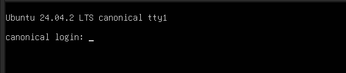
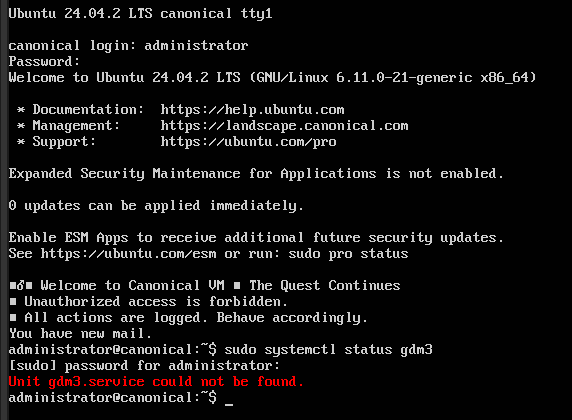
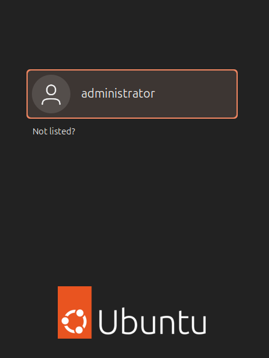
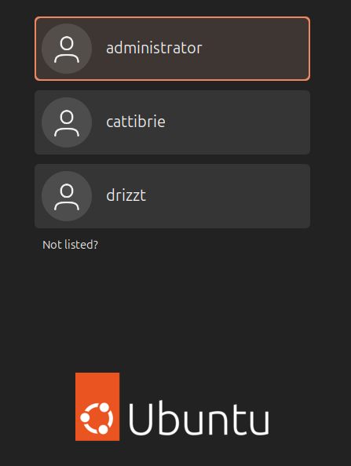

# Desktop Recovery

## Goal

Simulate and recover from a broken GUI login on Ubuntu caused by disabling or removing the display manager. Demonstrates CLI recovery and understanding of essential desktop services.

---

## Phase 1: Break the System (simulated user error)

To break the GUI I'm going to remove and purge the gdm3 display manager. Big oopsie...
The expected result of this will be seeing just a black screen on reboot. 

```bash
sudo apt remove gdm3 --purge
sudo reboot
```



Umm....success?

---

## Phase 2: Diagnosis

Upon reboot, we're presented with just the shell access as expected. Now to see what the problem is...

```bash 
sudo systemctl status gdm3
```

 

---

## Phase 3: The Fix

This is a fairly quick fix, just need to re-install the package and reload it.

```bash 
sudo apt update
sudo apt install gdm3
sudo systemctl restart gdm3
```



---

### Bonus: Where are the two users that were created in the last lab?

When I created the two users in the last lab, I skipped over creating passwords for them for reasons of brevity. However, GDM3 won't show users at the login screen if they don't have a password set which means they can't log in. 
Easy fix:

```bash 
sudo passwd cattiebrie
sudo passwd drizzt
```



## Summary

This lab simulates a common desktop support scenario: restoring a broken GUI after the display manager (GDM3) has been removed. The goal is to demonstrate familiarity with Ubuntu system services, package recovery, and login behavior.
Key outcomes:
   - Recovered a non-booting GUI system using CLI tools only
   - Reinstalled and restarted GDM3 without needing to escalate the issue
   - Diagnosed a hidden-user login issue and resolved it by setting user passwords

---

