# Ubuntu Install

---

## Goal

Building a fresh Ubuntu 24.04 desktop environment and hardening the system. Tools used will include enabling SSH, encryption, back-up volume, firewall management etc. 

---

## Setup

- I'll be using Vmware Workstation Pro (17.x) for this build. As such, secure boot is not easily demonstrated in a virtual environment, but it should be noted that the use of secure boot (set in BIOS) is a crucial step in hardening any system, be it for personal use or in an enterprise environment. 
- The install will be a minimal install, leaving out much of the additional and commonly installed apps. 
- After the initial install and boot up, a second disk will be created for this system to be used as a virtual backup drive.

---

### Post Install - First Boot

Starting with the updates and upgrades as always. 
```bash
sudo apt update && sudo apt upgrade -y
```
Now I'll install the **Unattended-upgrades** to remove the need for manually checking for updates. 
```bash
sudo dpkg-reconfigure --priority=low unattended-upgrades
```

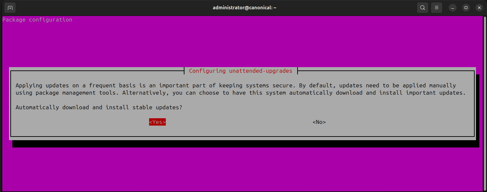


Next up is to install the openSSH-server package as I plan to enable SSH connectivity.
```bash
sudo apt install openssh-server -y
```

---

## Core Administration Tasks

### Starting with **UFW** rules. 

Enabling the Firewall, ensuring input and output rules and allowing SSH connection (more on this later)

```bash
sudo ufw enable
sudo ufw status verbose
sudo ufw ufw allow 22/tcp # standard SSH port
sudo ufw status verbose
sudo reboot
```

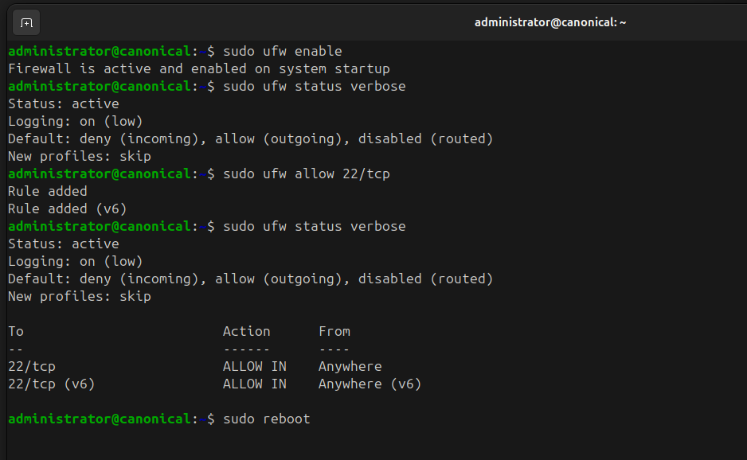

---

### 📋 Logging & Auditing

Installing and setup of Logwatch
```bash
sudo apt install auditd logwatch -y
```
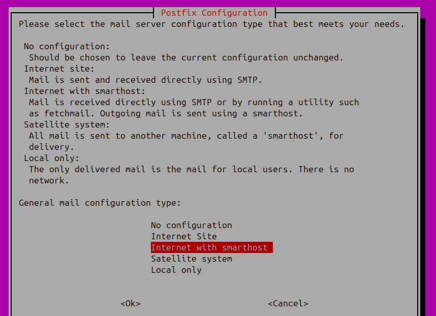
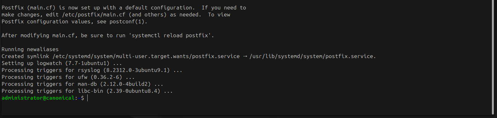


I setup my own email for this demo and sent off a report to show it's functioning.
```bash
sudo logwatch --detail High --range today --service all --output mail
```
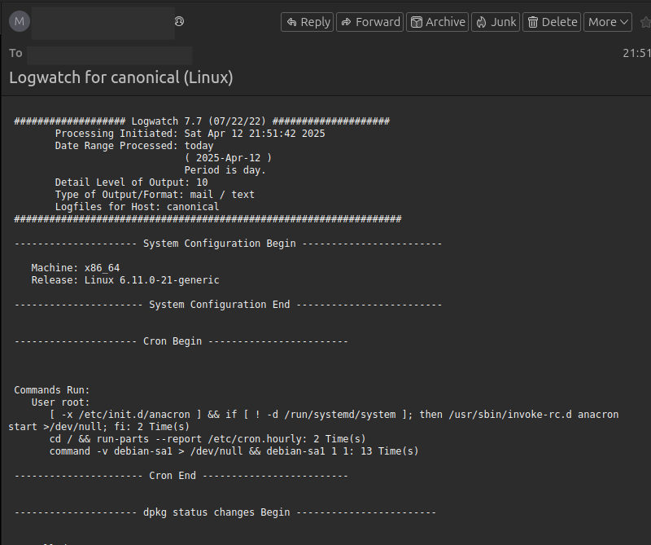

---

### SSH Keys

Using SSH keys are an important step in maintaining a secure environment. For this demo I'll create the keys, install them, and test to ensure that the setup is functioning. 

```bash
ssh-keygen -t rsa -b 4096 -C "canonical_vm_key"
cat ~/.ssh/id_rsa.pub >> ~/.ssh/authorized_keys
chmod 600 ~/.ssh/authorized_keys
```
For the demo, I used the default save location, and I didn't bother adding a passphrase. Adding a passphrase would be a proper step in fully securing a system. 

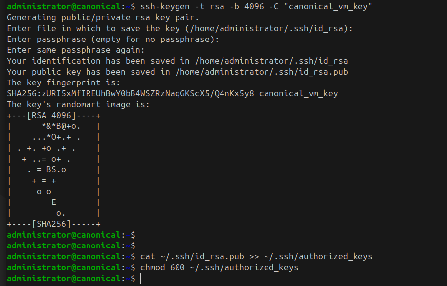


Hardening the SSH Daemon Config
```bash
sudo nano /etc/ssh/ssh_config
```
The changes made to the config file will prevent remote login to the *root user*

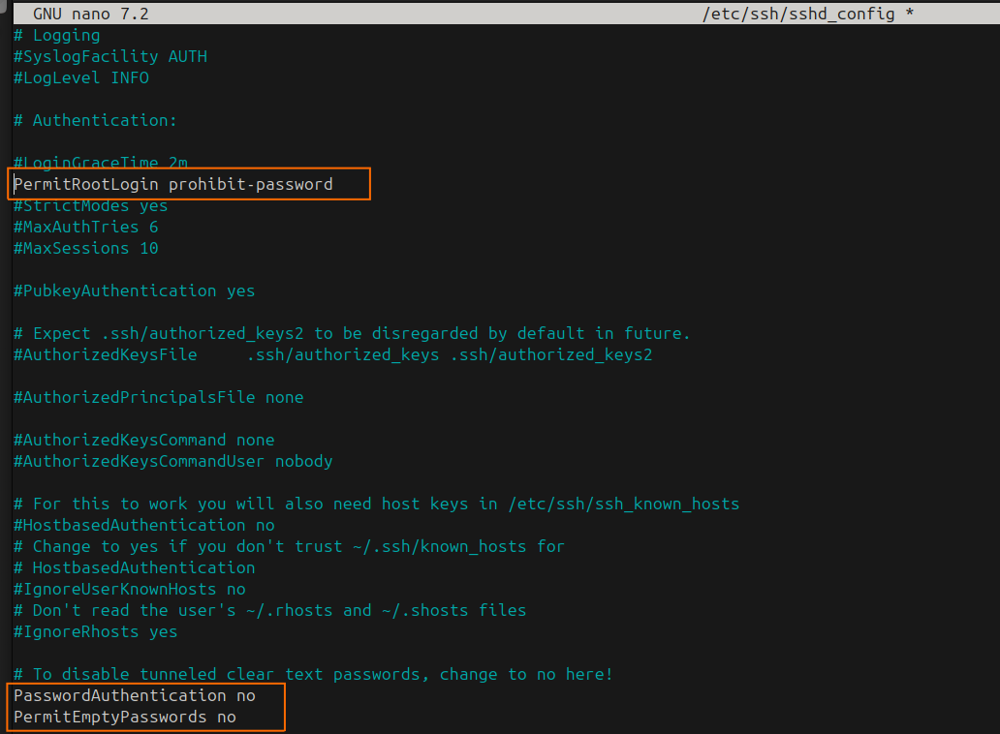

Testing the Connection:

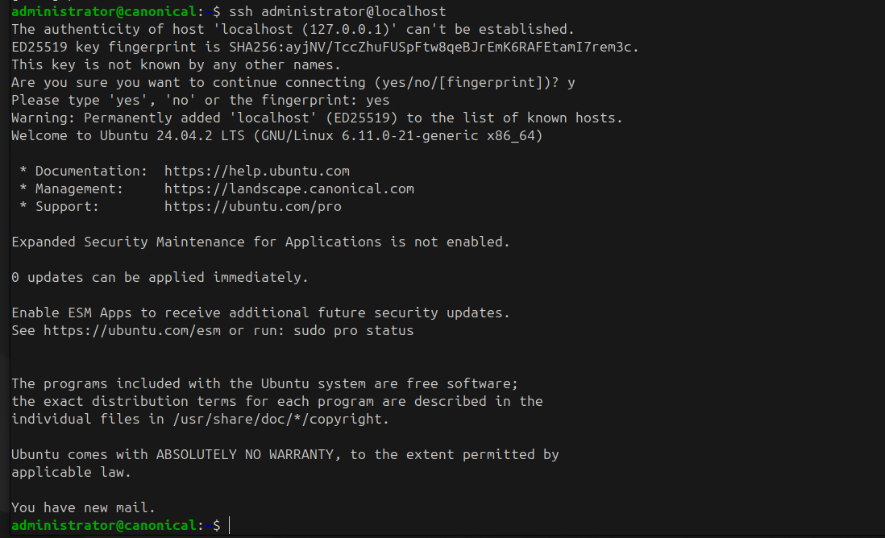

---

## Back-ups

For this section of the demo, I created a separate drive for to be used as the backup. I will show the steps to identify the drive to be used, format it, mount it and set up the backup to that drive.

```bash
lsblk  # drive discovery -- because formatting the wrong drive is...bad
sudo mkfs.ext4 /dev/sdb
sudo mkdir -p /mnt/backup_scrolls
sudo mount /dev/sdv /mnt/backup_scrolls
df -h | grep backup_scrolls # to confirm 
```
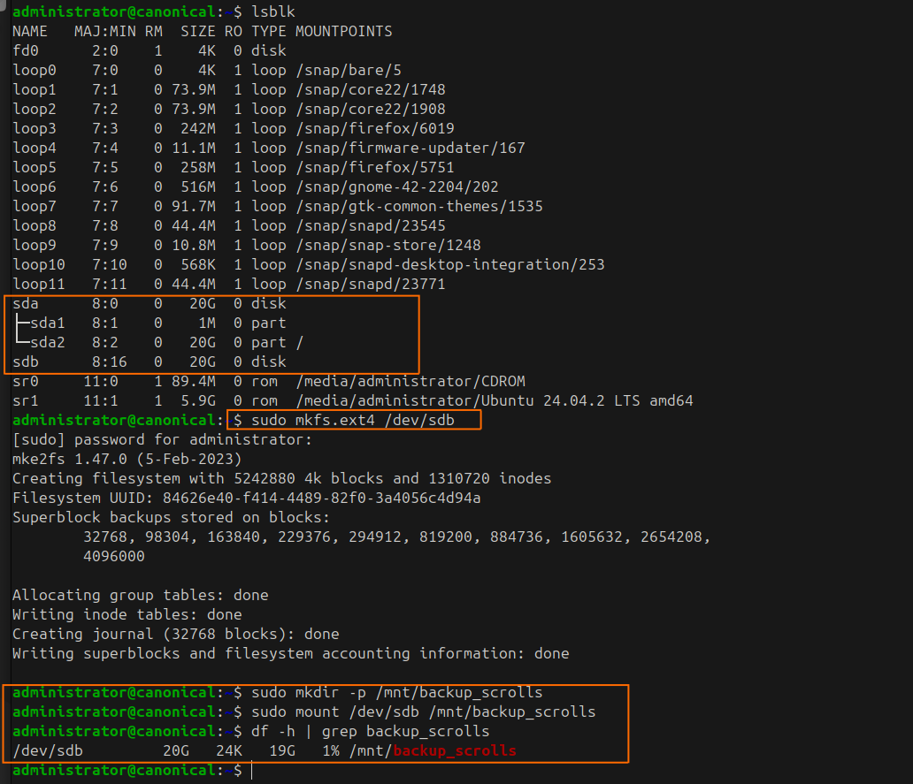

Performing a Basic Manual Backup

```bash
sudo rsync -a /home/administrator/ /mnt/backup_scrolls/backup-home
ls -lah /mnt/backup_scrolls/backup-home
```
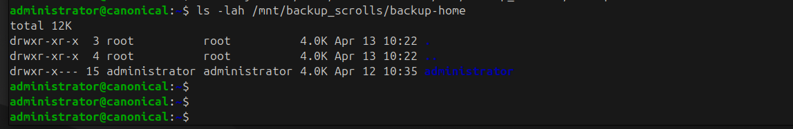

---

## Extras

Here I'll demo a few more basic adminitrative tasks like creating users and groups, and disabling guest users. 

```bash 
sudo adduser cattibrie # using the interactive option to add users here
sudo adduser drizzt  # as this is a demo, I didn't fill out all the details as one normally would
sudo groupadd sorcerers
sudo groupadd security
sudo usermod -aG sorcerers cattibrie
sudo usermod -aG security drizzt
```

Disabling Guest Logins on GNOME
```bash
sudo mkdir -p /etc/gdm3
echo "[deamon]" | sudo tee /etc/gdm3/custom.conf
echo "AllowGuest=false" | sudo tee -a /etc/gdm3/custom.conf
```

Adding a Custom MOTD Message
```bash
sudo nano /etc/motd
```
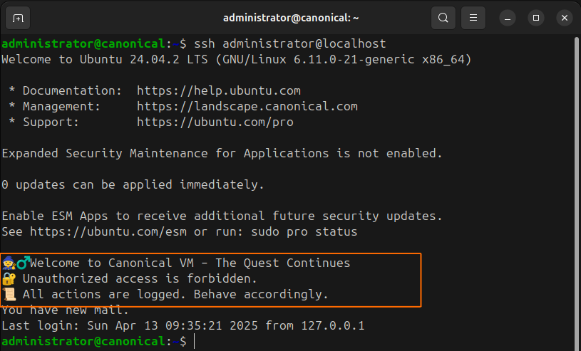

---

## Summary

This lab simulates a secure desktop deployment of Ubuntu 24.04 in a virtualized environment. It was built as part of the canon_quest project to demonstrate core Linux administration skills relevant to real-world support roles.

